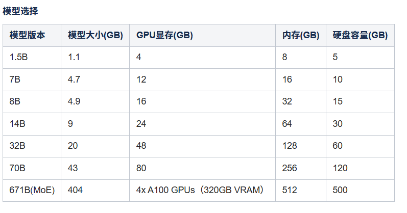

# 一、环境准备

## docker和docker compose

```
#更新软件包索引
apt update

#安装常用工具
apt install -y ca-certificates curl gnupg lsb-release

#创建密钥存放目录
sudo install -m 0755 -d /etc/apt/keyrings

#使用阿里云镜像站下载 GPG 密钥
sudo curl -fsSL https://mirrors.aliyun.com/docker-ce/linux/ubuntu/gpg -o /etc/apt/keyrings/docker.asc
sudo chmod a+r /etc/apt/keyrings/docker.asc

#添加阿里云 Docker APT 仓库
echo \
  "deb [arch=$(dpkg --print-architecture) signed-by=/etc/apt/keyrings/docker.asc] https://mirrors.aliyun.com/docker-ce/linux/ubuntu \
  $(. /etc/os-release && echo "$VERSION_CODENAME") stable" | \
  sudo tee /etc/apt/sources.list.d/docker.list > /dev/null

#更新 APT 索引
sudo apt-get update
```

做好docker源准备后，安装docker和docker compose

```
apt-get install -y docker-ce docker-ce-cli containerd.io

apt-get install -y docker-compose-plugin

#安装docker依赖
apt-get -y install apt-transport-https ca-certificates curl software-properties-common
```

验证

```
docker --version

docker compose version
```

配置镜像加速文件（vim /etc/docker/daemon.json）

```
{
  "log-opts": {
    "max-size": "5m",
    "max-file":"3"
  },
  "exec-opts": ["native.cgroupdriver=systemd"],
  "registry-mirrors": [
        "https://docker.m.daocloud.io",
        "https://dockerproxy.com",
        "https://docker.mirrors.ustc.edu.cn",
        "https://docker.nju.edu.cn",
        "http://hammal.staronearth.win/",
        "http://hub.staronearth.win/"
                        ],
  "insecure-registries":["10.203.41.23","http://10.203.41.20:8088","harbor.baway.work"]

}
```

重启docker

```
systemctl restart docker
```

# 二、部署Ollama

## 1、拉取镜像

```
docker pull 10.203.41.20:8088/ai/ollama/ollama

#查看镜像
docker images
```

## 2、创建并启动容器

```
#没有指定名字，创建出来的容器名字随机生成
docker run -d -v ollama:/root/.ollama -p 11434:11434 10.203.41.20:8088/ai/ollama/ollama

#将容器的名字从happy_wing改为ollama（看实际情况，创建出来的名字不一定是happy_wing）
docker rename happy_wing ollama

#查看容器
docker ps
```

## 3、安装deepseek模型



### 1）容器外部

```
#这里安装的是7b模型（包括启动）
docker exec -it ollama ollama run deepseek-r1:7b
```

```
#查看模型列表
docker exec -it ollama ollama list

#删除模型
docker exec -it ollama ollama rm deepseek-r1:7b

#查看正在运行的模型
docker exec -it ollama ollama ps

#下载/拉取模型
docker exec -it ollama ollama pull deepseek-r1:7b

#查看模型的详细信息
docker exec -it ollama ollama show deepseek-r1:7b

#查看ollama版本
docker exec -it ollama ollama --version
```

### 2）容器内部

```
#启动模型
ollama run deepseek-r1:7b

#查看列表
ollama list

#删除模型
ollama rm deepseek-r1:7b

#查看正在运行的模型
ollama ps

#下载模型
ollama pull deepseek-r1:7b

#查看模型的详细信息
ollama show deepseek-r1:7b
```

## 4、验证模型

```
curl 192.168.23.236:11434

#结果显示
Ollama is runningroot  #说明模型安装成功
```

### 三、部署Dify

## 1、克隆仓库

```
git clone http://git.baway.work/ai/dify-1.10.0.git
```

## 2、启动dify

```
#进入目录
cd dify-1.10.0/docker

#启动容器
docker compose up -d

#查看容器状态
docker compose ps
```

## 3、测试访问dify

打开浏览器，访问http://192.168.23.236/install

设置管理员账户


登录

http://192.168.23.236


# 四、dify使用指南

## 1、安装模型商


常见问题：


这个是对应的Ollama服务没有启动，导致连接失败

## 2、创建知识库


这里等待文档嵌入成功


## 3、创建应用


# 五、采用云GPU运行大模型

原因：使用CPU部署Ollama，跑大模型 ，需要的硬件配置高，而且响应速度极慢，影响用户体验感

## 1、购买云GPU

www.autodl.com


我们这里租用的是RTX 2080 Ti 
（图片内容仅为示例，以实际内容为主）


## 2、上传文件包

```
#将Ollama对应的安装包上传到GPU机器上
rsync -avz --progress -e "ssh -p 32590" bin [root@region-42.seetacloud.com:/tmp/](mailto:root@region-42.seetacloud.com:/tmp/)
```

## 3、安装Ollama

进入到GPU中，找到对应的包，执行安装

```
#安装脚本
bash install_ollama.sh

export OLLAMA_HOST=127.0.0.1:6006

#后台运行
nohup ollama serve &

#在GPU运行模型
ollama run deepseek-r1:7b
```

## 4、开放6006端口


在虚拟机上执行，如果没有信息弹出，说明正常，端口已放开

## 5、配置Dify

点击编辑


最后测试，与AI对话，在云GPU上执行

```
#实时监控运行状态
nvidia-smi -l 1
```